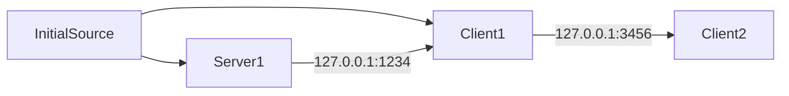

# ServerClientTCP
Simple test application for running a server (Server1), an intermediate client and server (Client1), and a client (Client2) using TCP/IP socket creation

Tools/Libraries:
.NET Console App for hosting and connecting
Blazor Web App's WebAssembly for displaying graphics
System.Net for network endpoint and stream creation
System.Net.Sockets for network socket creation
System.Timers.Timer for clocking packet send frequency
System.Runtime.InteropServices.Marshal for struct and byte array conversion

