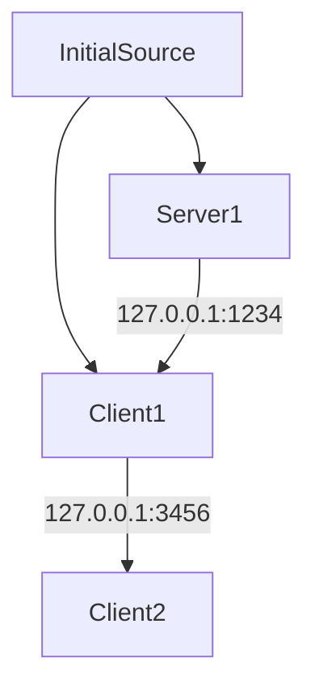

# ServerClientTCP
Simple test application for running a server, an intermediate client and server, and a client using TCP/IP socket creation

Uses .NET Console App for hosting and connecting

Uses Blazor Web App's WebAssembly for displaying graphics

